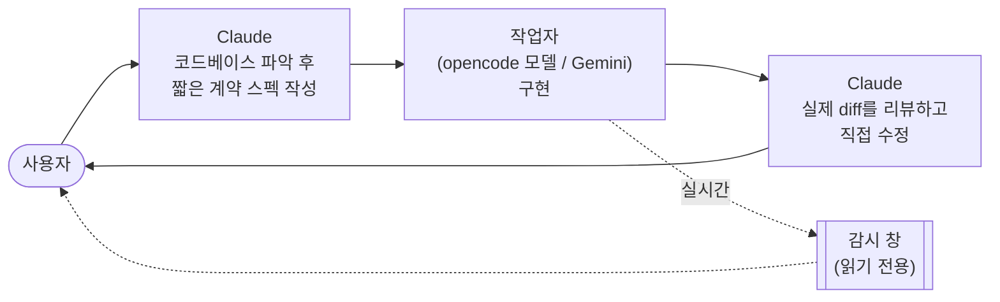

<div align="center">

# claude-delegate-skills

**설계와 리뷰는 Claude가, 코드 작성은 저렴한 모델이.**

[Claude Code](https://claude.com/claude-code)용 스킬 두 개입니다. 구현 작업의 대부분을 저렴한 코딩 에이전트에게
넘기고 Claude는 중요한 두 역할만 맡습니다. 작업 전에는 설계자, 작업 후에는 깐깐한 리뷰어입니다. 작업자는
[opencode](https://opencode.ai)로 돌리는 아무 모델(GLM 등)이나 Antigravity CLI로 돌리는 Gemini입니다.

[English](README.md) · [한국어](README.ko.md)

</div>

---

## 왜 필요한가

기능 하나에 들어가는 코드는 대부분 어렵지 않습니다. 보일러플레이트, 배선, 포팅, 테스트 묶음, 이미 있는
패턴의 다섯 번째 변형 같은 것들입니다. 이걸 최상위 모델 단가로 뽑는 건 낭비입니다. 그렇다고 싼 모델에게
감독 없이 맡기면 더 나쁩니다. 겉보기엔 완성된 코드와 "테스트까지 마쳤다"는 자신만만한 요약이 돌아옵니다.

그래서 일을 이렇게 나눕니다.



- **스펙은 계약이지 구현이 아닙니다.** 인터페이스, 동작, 엣지 케이스, 참고할 파일만 적고 코드는 절대 넣지
  않습니다. 스펙으로 쓰려면 사실상 코드를 써야 하는 부분은 Claude가 직접 구현합니다.
- **작업자의 보고는 주장이지 증거가 아닙니다.** 리뷰는 작업자의 요약이 아니라 실제 diff와 도구 호출 기록을
  기준으로 합니다.
- **실수는 Claude가 직접 고칩니다.** 작업자에게 자기 실수를 다시 고치라고 돌려보내지 않습니다. 그 왕복이
  직접 고치는 것보다 비쌉니다. (단, *중간에 끊긴* 실행은 다릅니다. [이어가기](#끊긴-실행-처음부터가-아니라-이어서) 참고)

## 구성

| 스킬 | 작업자 | 강점 |
|---|---|---|
| [`opencode-delegate`](skills/opencode-delegate) | `opencode` CLI로 돌리는 아무 모델 (GLM, Qwen, DeepSeek 등) | 백엔드, 스크립트, 리팩터링, 테스트, 포팅. 싸고 빠릅니다. |
| [`antigravity-delegate`](skills/antigravity-delegate) | Antigravity `agy` CLI의 최신 Gemini (자동 선택) | 위와 같고 UI 작업도 됩니다. 작업자가 이미지를 볼 수 있고, 가짜 버튼 검사 도구가 포함돼 있습니다. |

두 스킬은 작업 흐름, 플래그, 실행 폴더 형식, 실시간 보기가 모두 같습니다.

## 기능

### 실시간 보기: 더는 허공만 보며 기다리지 않습니다

예전에는 위임하면 최대 한 시간짜리 블랙박스였습니다. 이제는 작업자가 시작하는 순간 **읽기 전용 콘솔 창**이
따로 뜨고, 작업자가 하는 일이 실시간으로 올라옵니다.

```text
[15:22:04] TOOL read  calc.py
[15:22:07] TOOL edit  calc.py
[15:22:07] TOOL write  test_calc.py
[15:22:08] TOOL shell  python -m pytest -q
[15:22:12] ok   run_command 2s  .... [100%] 4 passed in 0.02s
[15:22:15] SAY  Done. The spec was clear and matched the code ...
 running | opencode zai/glm-5.3-flash#high | 0:42 elapsed | 5 tool calls | last activity 0:03 ago (auto-kill at 10:00)
```

- 상태줄은 2분 동안 조용하면 **노랑**, 5분이면 **빨강**으로 바뀝니다. 멈춘 실행이 바로 보입니다.
- `--idle-timeout`초(기본 600초) 동안 아무 출력이 없으면 멈춘 걸로 보고 하위 프로세스까지 종료합니다.
  리포트에는 `STALLED`로 남습니다. 30~60분 타임아웃을 조용히 다 써버리는 일이 없습니다.
- 창을 닫아도 작업자에는 영향이 없습니다. `python scripts/watch.py`로 가장 최근 실행에 다시 붙을 수 있습니다.
- Claude에게 "작업자 지금 뭐 해?"라고 물으면 추측하지 않고 같은 실시간 로그를 읽어서 답합니다.

### 끊긴 실행: 처음부터가 아니라 이어서

실행이 *중간에 끊기면* (API 에러, 세션 에러, 타임아웃, 멈춤, 아무도 답할 수 없는 질문을 하다 멈춤)
Claude는 일을 직접 가져가지도 않고, 모든 걸 잊은 새 실행을 시작하지도 않습니다. 짧은 후속 메모를 써서
**같은 작업자 세션**을 이어갑니다.

```bash
python delegate.py --session <리포트의-ID> --spec followup.md --cwd <프로젝트>
```

비정상 종료 시 리포트에 세션 ID와 바로 쓸 수 있는 이어가기 명령이 출력됩니다. 작업자가 최종 메시지까지 다
보낸 *뒤에* 에러가 난 경우는 따로 알아보고 표시해서, 괜히 이어가기를 하지 않습니다.

### 주장 말고 증거

실행할 때마다 폴더가 하나 생깁니다. 위치는 시스템 임시 폴더이고, 프로젝트 안에는 절대 만들지 않습니다.

| 파일 | 내용 |
|---|---|
| `report.md` | 수정/추가/삭제된 파일, 종료 상태, 토큰, 세션 ID, 작업자의 최종 메시지 |
| `changes.patch` | 실행 직전 스냅샷 대비 실제 diff (git HEAD 기준이 아님) |
| `live.log` / `status.json` | 작업자가 도는 동안 기록되는 활동 로그와 상태 |
| `trace.md` *(antigravity)* | 모든 도구 호출과 그 출력. "테스트 돌렸어요"의 진위를 가리는 기준 |
| `suspects.md` *(antigravity)* | 추가된 줄에서 가짜 구현 냄새를 정적 스캔. 빈 핸들러, `href="#"`, 일하는 척하는 `setTimeout`, 저장 없는 "Saved!", 실패할 수 없는 테스트, 목 데이터 등 |
| `events.jsonl` | 원본 이벤트 스트림 |

`antigravity-delegate`에는 `ui_audit.py`도 들어 있습니다. 데스크톱/모바일 크기로 스크린샷을 찍고, 모든
인터랙티브 요소를 새 페이지에서 하나씩 클릭해서 **아무 일도 일어나지 않는** 요소를 표시합니다. 연결된 척만
하는 "구라 버튼"을 잡는 도구입니다.

### 위임 강도 조절

| 플래그 | 값 | 의미 |
|---|---|---|
| `--level` | `default` · `high` · `full` | Claude가 얼마나 정하는지: 계약 스펙, 한 장짜리 큰 그림, 방향만 정한 짧은 브리프 |
| `--review` | `full` · `smoke` · `none` | 줄 단위 diff 리뷰, 검증 명령과 리포트만 확인, 리뷰 생략 |
| `--mode` | `implement` · `investigate` | 구현, 또는 읽기 전용 원인 분석 (Claude가 근거를 직접 확인) |

자주 쓰는 조합: 중간 규모는 `high --review smoke`, 반복 작업은 `default --review smoke`, 완전히 맡길 땐
`full --review none`.

## 설치

**필요한 것**
- [Claude Code](https://claude.com/claude-code)
- Python 3.8+
- `PATH`에 작업자 CLI 하나 이상:
  - `opencode` (원하는 프로바이더와 모델 설정)
  - `agy` (Antigravity CLI, 로그인 필요)
- *(선택, UI 검사용)* `pip install playwright`. 설치된 Edge/Chrome을 쓰므로 브라우저를 따로 받지 않습니다.

**스킬을 Claude Code에 복사:**

```bash
git clone https://github.com/digital8150/claude-delegate-skills
cp -r claude-delegate-skills/skills/* ~/.claude/skills/
```

Windows (PowerShell):

```powershell
git clone https://github.com/digital8150/claude-delegate-skills
Copy-Item -Recurse claude-delegate-skills\skills\* $HOME\.claude\skills\
```

### 작업자 모델 고르기

이미 쓰고 있는 모델과 프로바이더를 그대로 쓰면 됩니다. 각 스킬은 이 순서로 모델을 정합니다.

1. 명령줄의 `--model` (Claude에게 "X 모델로 해줘"라고 해도 됨)
2. 환경변수 `OPENCODE_DELEGATE_MODEL` / `ANTIGRAVITY_DELEGATE_MODEL`
3. `~/.claude/skills/<스킬>/config.json`의 `"model"` (`config.example.json`을 복사해서 시작)
4. 기본값
   - **opencode**: `-m`을 넘기지 않으므로 본인 opencode 설정의 기본 모델을 씁니다.
   - **antigravity**: `agy models`에서 `-high` 단계의 최신 Gemini를 자동으로 고릅니다.

```jsonc
// ~/.claude/skills/opencode-delegate/config.json
{ "model": "zai/glm-5.3-flash#high" }
```

모델 ID는 `opencode models` / `agy models`에 나오는 그대로 쓰면 됩니다 (opencode는 `provider/model#variant` 형식).
`config.json`은 git이 무시하므로 `git pull`해도 설정이 유지됩니다.

## 사용법

Claude Code에 평소 말투로 요청하면 됩니다.

> opencode한테 위임해줘: 리포트 페이지에 CSV 내보내기 추가

> antigravity한테 시켜: 설정 화면 만들어줘, review smoke로

> worker로 콜드 스타트 때 캐시가 왜 빗나가는지 조사해줘 (`--mode investigate`)

Claude가 위임할 만한 작업인지 판단하고, 스펙을 쓰고, 작업자를 백그라운드로 돌리고, 감시 창을 띄우고, 결과를
리뷰합니다. 그다음 무엇을 맡겼는지, 무엇이 틀렸는지, 무엇을 직접 고쳤는지 보고합니다.

직접 실행할 수도 있습니다.

```bash
python ~/.claude/skills/opencode-delegate/scripts/delegate.py --spec spec.md --cwd path/to/project
```

유용한 플래그: `--timeout 초`, `--idle-timeout 초` (`0`이면 끔), `--no-watch`, `--session ID`, `--model ID`.

## 주의사항

- **코드가 외부로 나갑니다.** 스펙과 작업자가 읽는 모든 파일이 작업자 모델 프로바이더로 전송됩니다.
  스펙에 비밀값을 넣지 말고, 외부로 보내면 안 되는 코드는 위임하지 마세요.
- **작업자는 `--cwd` 안에서 권한 자동 승인 상태로 돕니다.** `--cwd`는 반드시 해당 프로젝트를 가리키게 하고,
  관련 없는 작업이 섞인 상위 폴더를 가리키지 마세요.
- 감시 창은 Windows(새 콘솔)와 macOS(새 Terminal.app 창, 처음 한 번 자동화 권한을 물음)에서 자동으로 뜹니다. 그 외 OS이거나 창을 못 열면 두 번째 터미널에서 돌릴 `watch.py` 명령을 출력합니다.
- Windows 11에서 매일 쓰면서 다듬었습니다. macOS/Linux도 동작해야 하지만 덜 검증됐습니다.
- git이 무시하는 위치의 파일은 변경 감지에 잡히지 않습니다.

## 라이선스

[MIT](LICENSE)
