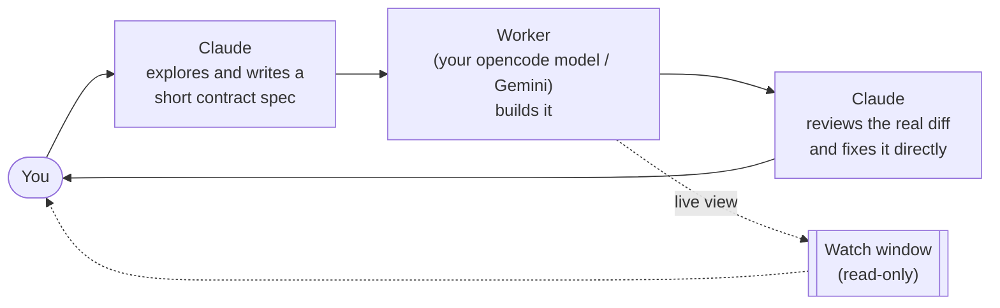

<div align="center">

# claude-delegate-skills

**Claude designs and reviews. A cheaper model writes the code.**

Two [Claude Code](https://claude.com/claude-code) skills that hand the bulk of implementation work to a cheaper
coding agent (any model you run through [opencode](https://opencode.ai), such as GLM, or Gemini via the Antigravity CLI) and keep Claude in the
seat that matters: architect before the work, adversarial reviewer after it.

[English](README.md) · [한국어](README.ko.md)

</div>

---

## Why

Most code in a feature is not hard. It is boilerplate, wiring, ports, test suites, and the fifth variation
of a pattern that already exists. Paying top-model rates for that output is a waste. Handing it to a cheap
model unsupervised is worse: you get code that *looks* finished, and a confident summary claiming it was tested.

These skills split the job:



- **The spec is a contract, not an implementation.** Interfaces, behaviors, edge cases, files to imitate.
  It never contains the code. If specifying a part would mean writing it, Claude writes that part itself.
- **The worker's report is a claim, not evidence.** Review is done against the real diff and a tool-call
  trace, never against the worker's own summary.
- **Claude fixes mistakes itself.** The worker is never sent back to redo its own bad work; that round
  trip costs more than the fix. (An *interrupted* run is different, see [resume](#interrupted-runs-resume-dont-restart).)

## What's inside

| Skill | Worker | Best at |
|---|---|---|
| [`opencode-delegate`](skills/opencode-delegate) | Any model you run through the `opencode` CLI (GLM, Qwen, DeepSeek, ...) | Backend, scripts, refactors, tests, ports. Cheap and fast. |
| [`antigravity-delegate`](skills/antigravity-delegate) | Latest Gemini through the Antigravity `agy` CLI (auto-detected) | Same, plus UI work: the worker can see images, and the skill ships a dead-button audit. |

Both share the same workflow, flags, run-folder format and live view.

## Features

### Live view: no more staring at nothing

A delegated run used to be a black box that took up to an hour. Now the moment a worker starts, a separate
**read-only console window** opens and shows what it is doing as it happens:

```text
[15:22:04] TOOL read  calc.py
[15:22:07] TOOL edit  calc.py
[15:22:07] TOOL write  test_calc.py
[15:22:08] TOOL shell  python -m pytest -q
[15:22:12] ok   run_command 2s  .... [100%] 4 passed in 0.02s
[15:22:15] SAY  Done. The spec was clear and matched the code ...
 running | opencode zai/glm-5.3-flash#high | 0:42 elapsed | 5 tool calls | last activity 0:03 ago (auto-kill at 10:00)
```

- The status bar turns **yellow** after 2 minutes of silence and **red** after 5, so a stuck run is obvious.
- A worker that emits nothing for `--idle-timeout` seconds (default 600) is treated as hung and killed
  (together with its child processes). The report says `STALLED`, instead of the run quietly eating its
  full 30-60 minute budget.
- Closing the window never affects the worker. `python scripts/watch.py` reattaches to the newest run.
- Ask Claude "how's the worker doing?" and it reads the same live log instead of guessing.

### Interrupted runs: resume, don't restart

When a run is *cut off* (API error, session error, timeout, stall, a question nobody could answer), Claude
neither takes the task over nor starts a fresh run that has forgotten everything. It writes a short
follow-up note and resumes **the same worker session**:

```bash
python delegate.py --session <id-from-report> --spec followup.md --cwd <project>
```

The report prints the session ID and a ready-made resume command whenever a run ends abnormally. It also
recognizes the case where the worker *finished* and the error only arrived after its final message, so
nothing gets resumed needlessly.

### Evidence, not claims

Every run writes a folder (under the system temp dir, never inside your project):

| File | What it is |
|---|---|
| `report.md` | Files modified/added/deleted, exit status, tokens, session ID, the worker's final message |
| `changes.patch` | The real unified diff, taken against a snapshot from just before the run (not git HEAD) |
| `live.log` / `status.json` | Human-readable activity log and heartbeat, written while the worker runs |
| `trace.md` *(antigravity)* | Every tool call with its output: the ground truth for "I ran the tests" |
| `suspects.md` *(antigravity)* | Static scan of added lines for fake-implementation smells: dead handlers, `href="#"`, `setTimeout` posing as work, "Saved!" with no save, hollow tests, mock data |
| `events.jsonl` | Raw event stream |

`antigravity-delegate` also ships `ui_audit.py`: it screenshots the page at desktop and mobile sizes, clicks
every interactive element in a fresh page, and flags the ones where **nothing happened**: the classic
"button that looks wired but isn't".

### Dial the hand-off

| Flag | Values | Meaning |
|---|---|---|
| `--level` | `default` · `high` · `full` | How much Claude specifies: a contract spec, a one-page plan, or a short direction brief that leaves everything else to the worker |
| `--review` | `full` · `smoke` · `none` | Line-by-line diff review, verification commands plus report only, or a full hand-off |
| `--mode` | `implement` · `investigate` | Build, or read-only root-cause hunting where Claude spot-checks the cited evidence |

Typical combos: `high --review smoke` for medium work, `default --review smoke` for routine repetitive edits,
`full --review none` for a complete hand-off.

## Install

**Requirements**
- [Claude Code](https://claude.com/claude-code)
- Python 3.8+
- At least one worker CLI on your `PATH`:
  - `opencode`, with whichever provider and model you like configured
  - `agy` (Antigravity CLI), logged in
- *(optional, UI audits)* `pip install playwright`. It drives your installed Edge/Chrome, so there is no browser download.

**Copy the skills into Claude Code:**

```bash
git clone https://github.com/digital8150/claude-delegate-skills
cp -r claude-delegate-skills/skills/* ~/.claude/skills/
```

On Windows (PowerShell):

```powershell
git clone https://github.com/digital8150/claude-delegate-skills
Copy-Item -Recurse claude-delegate-skills\skills\* $HOME\.claude\skills\
```

### Pick your worker model

Bring whatever model and provider you already use. Each skill resolves its model in this order:

1. `--model` on the command line (or "use model X" when you ask Claude)
2. An environment variable: `OPENCODE_DELEGATE_MODEL` / `ANTIGRAVITY_DELEGATE_MODEL`
3. `"model"` in `~/.claude/skills/<skill>/config.json` (copy `config.example.json` to start)
4. Fallback:
   - **opencode**: no `-m` is passed, so opencode uses the default model from your own opencode config.
   - **antigravity**: the newest Gemini model at the `-high` effort tier, auto-detected from `agy models`.

```jsonc
// ~/.claude/skills/opencode-delegate/config.json
{ "model": "zai/glm-5.3-flash#high" }
```

Model IDs are whatever `opencode models` or `agy models` lists for you (`provider/model#variant` for opencode).
`config.json` is git-ignored, so your choice survives `git pull`.

## Usage

Just ask Claude Code in plain language:

> delegate this to opencode: add CSV export to the reports page

> antigravity한테 시켜: 설정 화면 만들어줘, review smoke로

> use the worker to investigate why the cache misses on cold start (`--mode investigate`)

Claude decides whether the task is worth delegating, writes the spec, runs the worker in the background,
opens the live view, reviews the result and reports back what was delegated, what was wrong, and what it
fixed.

You can also run a worker by hand:

```bash
python ~/.claude/skills/opencode-delegate/scripts/delegate.py --spec spec.md --cwd path/to/project
```

Useful flags: `--timeout SEC`, `--idle-timeout SEC` (`0` disables), `--no-watch`, `--session ID`, `--model ID`.

## Caveats

- **Your code leaves your machine.** The spec and every file the worker reads go to the worker's model provider.
  Keep secrets out of specs, and don't delegate code you aren't allowed to send.
- **Workers run with auto-approved permissions** inside `--cwd`. Point `--cwd` at the project, never at a parent directory that holds unrelated work.
- The auto-opening watch window is Windows-only. Elsewhere the script prints the `watch.py` command to run in a second terminal.
- Developed and used daily on Windows 11. macOS/Linux should work but are less exercised.
- Files in git-ignored locations aren't tracked by change detection.

## License

[MIT](LICENSE)
